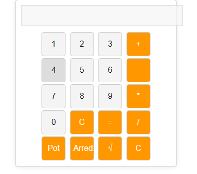

# calculadora-simples-2

Este é um projeto criado para uma atividade do Curso de Graduação em Ciência da Computação, na disciplina de Programação Web e consiste numa calculadora bem simples, que utiliza apenas HTML, CSS e Javascript e possui funções de soma, subtração, multiplicação, divisão, arredondamento, potência, entre outros. 

Acesse aqui: https://nathyalves.github.io/calculadora-simples-2/
